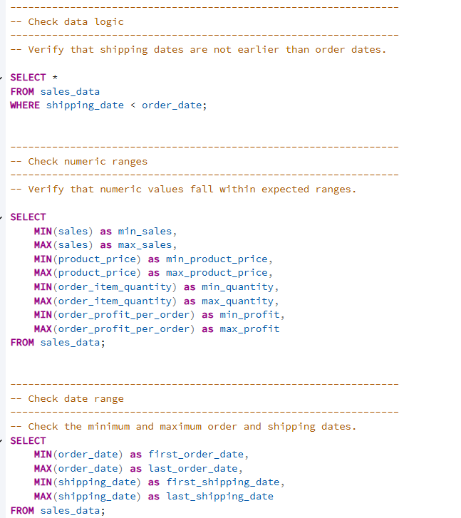
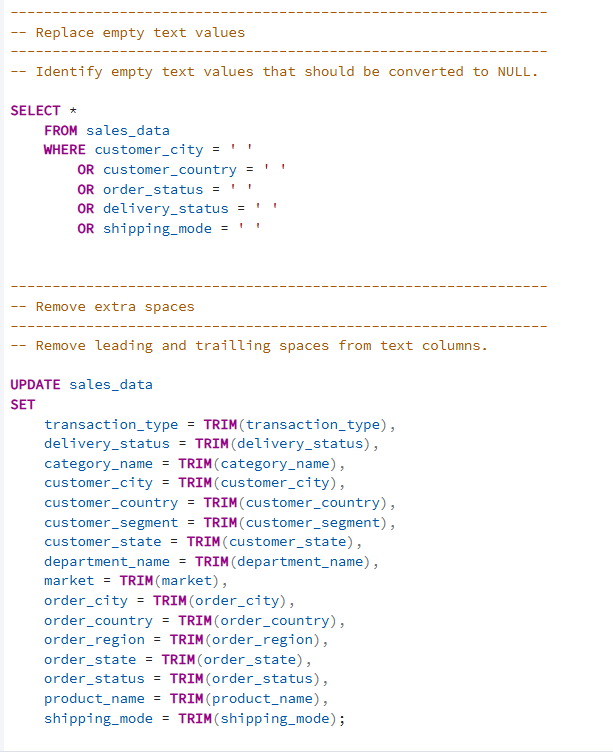
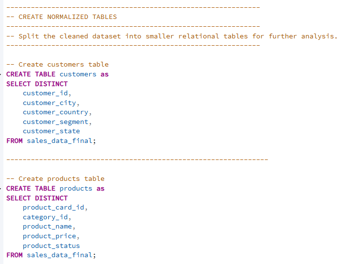
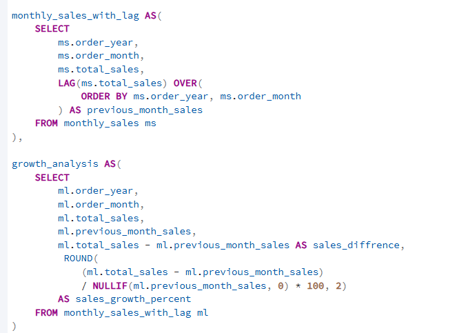
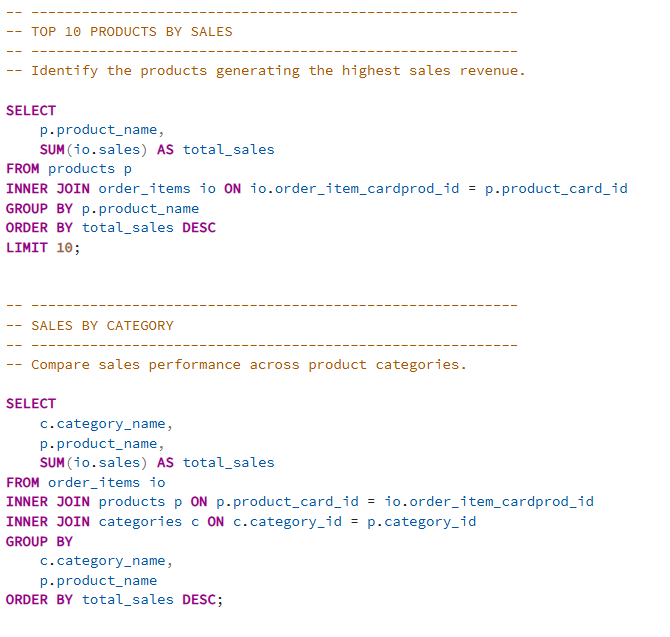
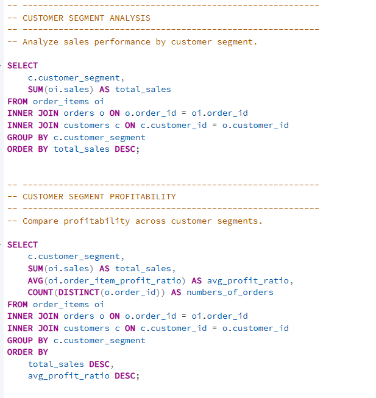
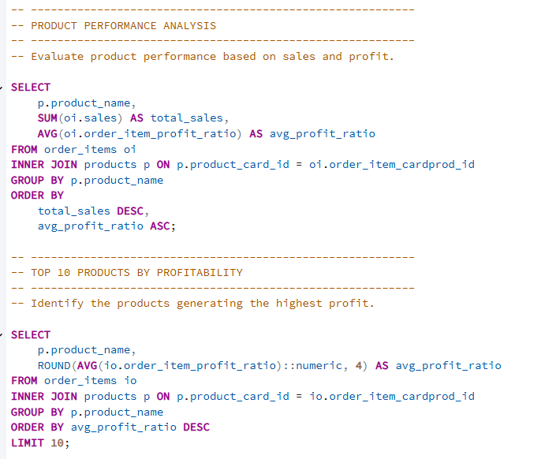
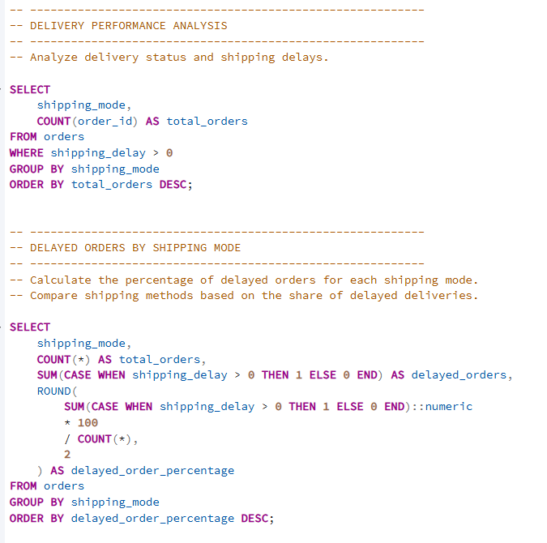

# Supply-Chain-SQL-Analysis
End-to-end SQL data analysis project using PostgreSQL and a Supply Chain dataset.
# Supply Chain SQL Analysis

## 📌 Project Overview

This project demonstrates an end-to-end SQL data analysis workflow using PostgreSQL. Starting from a raw transactional dataset, I performed data quality checks, cleaned and transformed the data, built a normalized relational database model, and answered business-oriented questions using SQL.

The goal of this project was not only to practice SQL syntax, but also to simulate a real-world data analysis process—from preparing raw data to generating meaningful business insights.

---

## 🎯 Business Objectives

The analysis was designed to answer several business questions, including:

* Which product categories generate the highest sales?
* Which customer segments contribute the most revenue?
* How do discounts affect sales and profitability?
* Which shipping methods experience the highest delivery delays?
* How do sales change over time?
* Which regions generate the highest revenue?
* What seasonal patterns can be observed in sales performance?

---

## 🛠 Technologies Used

* PostgreSQL
* SQL
* Relational Database Modeling
* Data Cleaning
* Data Quality Assessment
* Common Table Expressions (CTEs)
* Window Functions
* Aggregate Functions
* Git
* GitHub

---

## 🔄 Project Workflow

```text
Raw CSV Dataset
        │
        ▼
Data Quality Check
        │
        ▼
Data Cleaning
        │
        ▼
Data Modeling
        │
        ▼
Business Analysis
        │
        ▼
Business Insights
```

---

## 📂 Repository Structure

```text
sql/
│
├── 01_create_table.sql
├── 02_data_quality_check.sql
├── 03_data_cleaning.sql
├── 04_data_modeling.sql
├── 05_constraints.sql
│
└── business_analysis/
    ├── 01_sales_analysis.sql
    ├── 02_customer_analysis.sql
    ├── 03_product_analysis.sql
    ├── 04_delivery_analysis.sql
    └── 05_advanced_analysis.sql

screenshots/

README.md
```

---

# 🔍 Data Quality Check

Before transforming the dataset, I assessed its quality to ensure the data was accurate, consistent, and suitable for analysis.

The quality assessment included:

- Checking for missing values in key columns
- Identifying empty text values
- Detecting duplicate records
- Verifying logical consistency between order and shipping dates
- Validating numeric ranges
- Reviewing categorical values for consistency

These checks helped identify potential data quality issues before the cleaning and transformation process.



*Checking missing values and validating the dataset before data cleaning.*

---

# 🧹 Data Cleaning

After validating the dataset, I prepared the data for further analysis by cleaning and standardizing its contents.

The cleaning process included:

- Replacing empty text values
- Removing leading and trailing spaces using `TRIM()`
- Creating calculated columns such as `shipping_delay` and `profit_margin`
- Preparing the final analytical table used throughout the project

These transformations improved data consistency and created a reliable foundation for the analytical phase.



*Cleaning and transforming the dataset before building the analytical model.*

---

# 🏗 Data Modeling

The cleaned dataset was transformed into a normalized relational database model to improve data organization and support efficient analysis.

The model consists of separate tables for:

- Customers
- Orders
- Order Items
- Products
- Categories

Primary and foreign keys were added to establish relationships between tables and ensure referential integrity.



*Creating a normalized relational database model from the cleaned dataset.*

---

# 📈 Time Analysis

Time-based analyses were performed to better understand how sales changed over different periods.

The analysis included:

- Monthly sales trends
- Seasonal sales performance
- Month-over-month sales growth

These analyses helped identify long-term trends and recurring seasonal patterns in sales performance.



*Analyzing sales trends and seasonal patterns over time.*

---

# 🚀 Advanced SQL

To extend the analytical capabilities of the project, I used more advanced SQL techniques that are commonly applied in real-world data analysis.

The project demonstrates the use of:

- Common Table Expressions (CTEs)
- Window Functions
- `LAG()`
- Ranking functions
- Aggregate calculations

These techniques made the analytical queries more efficient, readable, and easier to maintain.


*Using Common Table Expressions and Window Functions to perform advanced analytical calculations.*

---

# 📊 Business Analysis

The final stage of the project focused on answering business questions using the prepared relational dataset.

The analyses covered several business areas, including:

- Sales performance
- Customer behavior
- Product profitability
- Delivery performance

The goal was to identify trends, compare performance across different dimensions, and generate meaningful business insights.

## Sales Analysis



*Analyzing sales performance across regions and time periods.*

---

## Customer Analysis



*Comparing customer segments based on sales and profitability.*

---

## Product Analysis



*Evaluating product performance and identifying the most profitable categories.*

---

## Delivery Analysis



*Analyzing delivery performance and shipping delays across different shipping methods.*

---

# 💡 Key Business Insights

The analysis revealed several valuable business insights, including:

* Sales performance varied significantly across regions.
* Customer segments contributed differently to total revenue.
* A relatively small number of product categories generated a large share of total sales.
* Shipping methods differed in delivery performance and average shipping delays.
* Sales exhibited noticeable seasonal trends throughout the year.

---

# 📸 Project Screenshots

The repository also contains screenshots documenting the complete analytical workflow, including:

* Data Quality Checks
* Data Cleaning
* Data Modeling
* Business Analysis
* Advanced SQL Queries

---

# 🚀 Skills Demonstrated

This project demonstrates practical experience with:

* SQL Query Writing
* Data Cleaning & Transformation
* Data Validation
* Relational Database Modeling
* SQL Joins
* Aggregate Functions
* Common Table Expressions (CTEs)
* Window Functions
* Business Analysis
* Git & GitHub

---

# 📝 Conclusion

This project allowed me to practice the complete SQL data analysis workflow—from raw transactional data to business-oriented insights.

It also strengthened my skills in PostgreSQL, relational database design, analytical SQL, and project organization using GitHub.

---

## 👩 About the Author

Hi! I'm **Beata**, an aspiring Data Analyst passionate about transforming raw data into meaningful insights.

I'm continuously developing my skills in SQL, Excel, Power BI, and Python while building practical portfolio projects that reflect real-world analytical workflows.
